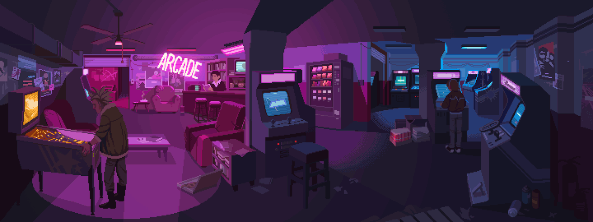

##  Dani Custodio

  👋 Hey there! I’m Dani, a software developer with around 5 years of experience,
  mostly in frontend (React), with a bit of iOS development in the mix.
  I love tackling new challenges and learning cool tech!

  Lately, I’ve been leveling up my backend skills, focusing on Node.js and Golang,
  while also pursuing a graduate course in Full-Stack Development.

 

##  Tech Stack

  
  
  
  
  
  
  
  

